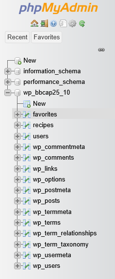

# Last Meal - Team 2

**Last Meal** is a website, where users can share their food recipes with others.
---

# Table of contents
- [Features](#features)
- [Database Tables](#database-tables)
- [Created Forms](#created-forms)
- [Created Tables](#created-tables)

---

# Features
**Feature 1** - (Jekaterina Zasijenko) - User registration/authorization 

**Feature 2** - (Martin Pevgonen) - Admin panel for moderation (admin is protected)

**Feature 3** - (Denis Anderson) - Recipe search and categorization using tags (allergens, time, cuisine) 

**Feature 4** - (Jekaterina Zasijenko) - Recipe uploading with step by step instructions, photos and ingredients

---

### Feature 1 
Users can be created and authorized. Info is stored in the database and authentication is working.

### Feature 2
Admin panel for moderating recipes and users. A separate panel that can only be accessed by role "Admin", so default users will not even know it is there. Only users with admin role can see the admin panel button. Makes life easier because we don't have to go to myphpadmin to delete users/recipes - can be expanded to have more moderation functions.

### Feature 3
Recipes can be searched and the tag bar can be applied to quickly sort through the recipes based on allergens, time to cook and other parameters - so even if user does not know the specific name of the dish he would want he can just play around with tags and find a fit.

### Feature 4 
Recipes can be created by logged in users. Users can add a picture, describe all the necessary ingredients and steps to be taken for the recipe to be made. Recipes appear on the "recipes" tab, once the submit button is pressed. 

# Database Tables

**Table 1** (Denis Anderson) - Users 
- stores all the user info, such as usernames, passwords, user id, and their roles

**Table 2** (Jekaterina Zasijenko) - Recipes
- stores recipe info: picture, name, ingredients, steps to take

**Table 3** (Martin Pevgonen) - Favorites
- stores user_id and recipe_id together to match favorite dishes to user accounts

## ER Diagram screenshot

---

# Created Forms

**Form 1(Jekaterina Zasijenko): Registration:** |
[github]() | [shell.hamk.fi](http://shell.hamk.fi/~bbcap25_10/website-ultra/src/account.php#) | 

Validations: trim() on username and email, password_hash() for secure storage; HTML required attribute (username, email, password); Database uniqueness check on username/email

**Form 2 (Jekaterina Zasijenko):Login:** | [github]() | [shell.hamk.fi](http://shell.hamk.fi/~bbcap25_10/website-ultra/src/account.php#) |

Validations: Error message "Wrong login or password"; username lookup in database + password_verify(); HTML required attribute (username, email, password)

**Form 3 (Denis Anderson): Recipe Submission:** | [github]() | [shell.hamk.fi](http://shell.hamk.fi/~bbcap25_10/website-ultra/src/poisonrecipe.php) |

Validations: HTML required attribute (title, ingredients[], steps[]); redirects to account.php if not logged in; image upload validation checks UPLOAD_ERR_OK, moves file to uploads/ folder

---

# Created Tables

**Table 1 (Martin Pevgonen):** Users Table | [github]() | [shell.hamk.fi](http://shell.hamk.fi/~bbcap25_10/website-ultra/src/admin/index.php) 

(Admin Panel → Users)  

 **Table 2 (Martin Pevgonen):** Recipes Table | [github]() | [shell.hamk.fi](http://shell.hamk.fi/~bbcap25_10/website-ultra/src/admin/index.php) 

(Admin Panel → Recipes)  

 **Table 3 (Denis Anderson):** Favorites Table | [github]() | [shell.hamk.fi](http://shell.hamk.fi/~bbcap25_10/website-ultra/src/admin/index.php) 
 
 (Admin Panel → Favorites)  

